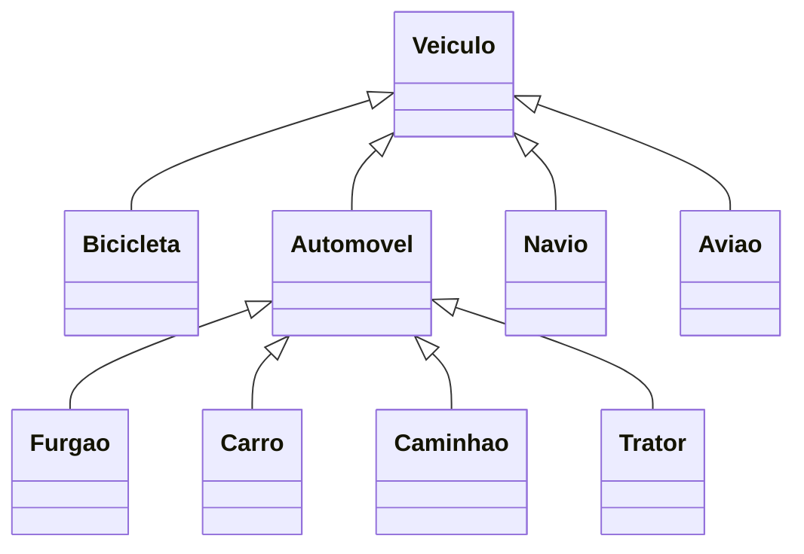

# Herança e Polimorfismo
## Princípios do Paradigma OO
- Abstração
- Encapsulamento
- Modularidade
- Hierarquia
## Abstração
- A representação computacional do objeto real deve se concentrar nas características relevantes para o problema.
- São criados somente os atributos e métodos necessários para o problema em mãos.
## Encapsulamento
- O objeto deve esconder seus dados e os detalhes de sua implementação
- Atributos e Métodos
  - Os métodos formam uma "cerca" em torno dos atributos
  - Os atributos não devem ser manipulados diretamente
  - Os atributos somente devem ser alterados ou consultados através dos métodos do objeto
## Modularidade
- Um programa OO é um conjunto de objetos que colaboram entre si para a solução de um problema
- Objetos colaboram através de chamadas de métodos uns dos outros
## Hierarquia
- Os objetos devem ser organizados no sistema de forma hierárquica
- Objetos herdam atributos e métodos dos seus ancestrais na hierarquia
- Para viabilizar a hierarquia entre objetos, as classes são organizadas em estruturas hierárquicas
  - A classe que forneceu os elementos herdados é chamada de **superclasse**
  - A classe herdeira é chamada de **subclasse**
  - A subclasse pode **herdar os métodos e atributos** de suas superclasses
  - A subclasse pode **definir novos atributos e métodos** específicos
- Exemplo:

- Exemplo de herança usando a classe Carro:
````mermaid
classDiagram
    Carro <|-- CarroInteligente
    Carro : -int velocidade
    Carro: +acelera()
    Carro: +freia()
    class CarroInteligente {
        +estaciona()
    }
````
## Polimorfismo
- Uma subclasse pode redefinir (sobrescrever) um método herdado
  - Este mecanismo é chamado de **polimorfismo**
  - O polimorfismo se realiza através da recodificação de um ou mais métodos herdados por uma subclasse
  - Em tempo de execução, o Java saberá qual implementação deve ser usada
## Compatibilidade de tipos
- Qualquer **subclasse** é compatível com sua **superclasse**
  - Contudo, a recíproca não é verdadeira
## Herança em Java
- Uma classe só pode herdar de uma outra classe (herança simples)
- Caso não seja declarada herança, a classe herda da classe Object
  - Ela define o método toString(), que retorna a representação em String do objeto
  - Qualquer subclasse pode sobrescrever o método toString() para retornar o que ela deseja
  - https://docs.oracle.com/javase/8/docs/api/java/lang/Object.html
## Interfaces
- Tipo especial de classe, que não tem implementação
  - Uma interface define um protocolo
  - Classes podem implementar uma ou mais interfaces
- Uma **interface é um contrato** assinado por uma classe
  - A interface define as responsabilidades da classe
  - As responsabilidades são mapeadas em métodos
  - A classe que implementa a interface implementa os métodos
  - A interface contém somente assinatura de métodos e constantes
- A definição de uma interface é similar a de uma classe
  - Utilizamos a palavra reservada **interface**
  - A palavra reservada deve ser seguida do nome da interface
  - Uma interface pode herder de outras interfaces (extends)
  - A interface possui apenas métodos sem implementação (abstratos) e constantes
````java
public interface Taxavel{
    int ANO_INICIO = 1996; // Fica implícito que é public, static e final
    double calculaTaxa();
}
````
````java
// Exemplo
public class CarroImportado extends Carro implements Taxavel{
    <atributos da CarroImportado>
    <métodos da CarroImportado>
    <métodos implementados da interface Taxavel>
}
````
## Classes Abstratas
- Se uma classe possui algum método sem implementação (abstrato), o modificador **abstract** deve preceder sua declaração
````java
abstract class Carro{
    <atributos da classe Carro>
    <métodos comuns da classe Carro>
    <métodos abstratos da classe Carro>
}
````
- Não podem ser usadas para instanciar objetos
- Devem ser vistas como **templates** para subclasses que irão dar uma implementação ao métodos abstratos
- Exemplo:
  - Classe abstrata Pagamento tem um método abstrato paga(...)
  - Classes concretas PagamentoVisa, PagamentoCheque, PagamentosDinheiro dão comportamento ao método paga(...)
````java
public abstract class Pagamento {
    public abstract void paga();
}

public class PagamentoVisa extends Pagamento{
    public void paga(){
        
    }
}
````