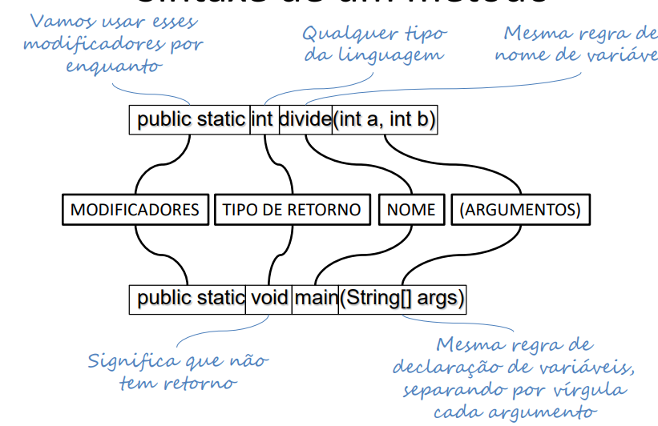
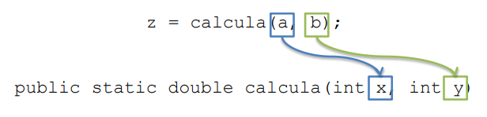

# Subprogramação
- **Métodos** são a estrutura mais básica de encapsulamento da Orientação a Objetos
## Fluxo de execução
- O programa tem início em um método principal (no caso do Java é o método **main**)
- O método principal chama outros métodos
- Estes métodos podem chamar outros métodos, sucessivamente
- Ao fim da execução de um método, o programa retorna para instrução seguinte à da chamada ao método
## Vantagens da subprogramação
- Economia de código
  - Quanto mais repetição, mais economia
- Facilidade na correção de defeitos
  - Corrigir o defeito em único local
- Legibilidade do código
  - Podemos dar nomes mais intuitivos a blocos de código
  - É como se criássemos nossos próprios comandos
- Melhor tratamento de complexidade
  - Estratégia de "dividir para conquistar" nos permite lidar melhor com a complexidade de programas grandes
  - Abordagem _top-down_ ajuda a pensar
## Sintaxe de um método

## Acesso a variáveis
- Um método não consegue acessar as variáveis de outros métodos
  - Cada métodos pode criar suas própria variáveis locais
  - Os parâmetros para a execução de um método devem ser definidos como argumentos do métodos
  - **Parâmetros** são os nomes dados aos atributos que uma função pode receber. Eles definem quais argumentos são aceitos pela função, podendo ou não ter valor padrão.
- Passagem por valor
  - Java copiará o valor de cada argumento para a respectiva variável
  - Os nomes das variáveis podem ser diferentes
  
## Passagem de ponteiro por valor
- Variáveis compostas são, na verdade, ponteiros.
- Seus endereços são passados por valor
  - Se criar uma nova variável, o efeito não é notado fora do método
  - Se trocar o valor de uma posição da variável, o efeito é notado fora do método
## Sobrecarga de métodos
- Uma classe pode ter **dois ou mais métodos com o mesmo nome**, desde que os tipos de seus argumentos sejam distintos
- Isso é útil quando queremos implementar um método em função de outro
- Exemplo
````java
class Exemplo {
    public int indexOf(String substring){
        return indexOf(substring, 0);
    }
}
````
## Métodos sem argumentos
- Não é necessário ter argumentos nos métodos
  - Nestes casos, é obrigatório ter () depois do nome do método
  - A chamada ao método também precisa conter ()
- Exemplo de declaração:
````java
public static void pulaLinha() {
    System.out.println();
}
````
- Exemplo de chamada:
  `pulaLinha();`